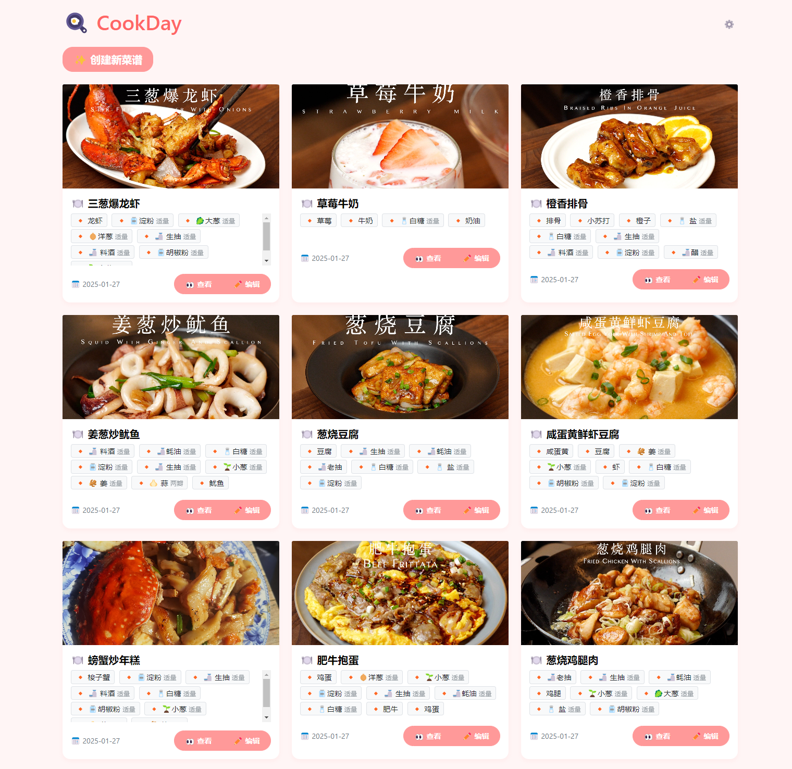

# CookDay

一款食谱记录程序，轻松记录食材、步骤和笔记，易于分享与管理。
记录您的每日烹饪，将其化为可回顾与共享的经验宝藏！
A recipe recording program that allows you to effortlessly document ingredients, steps, and notes, with easy sharing and management. Capture your daily cooking and turn it into a treasure trove of revisitable and shareable experiences!
<p dir="auto" align="center">
    <a href="https://cookday.bluish.net" rel="nofollow"></a>
    <a href="LICENSE"></a>
</p>
<div style="display: flex; justify-content: center; align-items: flex-start; padding: 10px; border-radius: 10px; width: fit-content; margin: 0 auto;">
  <a href="recipe.png" target="_blank">
    
  </a>
  <a href="recipe_edit.png" target="_blank">
    
  </a>
</div>

## ✨ 功能特色

* 📖 菜谱创建与管理
* 📋 食材清单管理
* 📝 制作步骤记录
* 📒 改进笔记记录
* 📷 成品图片上传
* 🎁 图片生成分享
* ⚙️ 管理模式登入
* 🔗 URL链接解析
* 🔎 常用食材快速选择
* 🔀 便捷拖动排序（常用食材、步骤、笔记、图片）

## 🚀 部署说明
### 安装步骤

1. 克隆仓库
```bash
git clone https://github.com/bluishwu/CookDay
cd CookDay-main
```

2. 安装依赖
```bash
pip install -r requirements.txt
```
依赖包括：
```
Flask==3.0.0
Flask-SQLAlchemy==3.1.1
Flask-Login==0.6.3
Pillow==10.2.0
Werkzeug==3.0.1
requests==2.31.0
beautifulsoup4==4.12.2 
```

3. 运行应用
```
python run.py
```
即可访问`http://localhost:5000` ，默认密码为`admin`，请及时更改。  
菜谱仅在管理状态下可编辑或创建。

### 目录结构
```
├── app/                    # 应用主目录
│   ├── static/            # 静态文件
│   │   ├── css/            # CSS样式文件
│   │   ├── js/             # JavaScript文件
│   │   └── uploads/         # 成品图片
│   ├── templates/         # 页面模板
│   │   ├── base.html            # 基础模板文件
│   │   ├── index.html           # 首页模板
│   │   ├── recipe_edit_modal.html  # 菜谱编辑弹窗模板
│   │   ├── recipe.html          # 菜谱详情页模板
│   ├── models.py         # 数据模型
│   └── routes.py         # 路由和视图
├── config.py            # 配置文件
├── requirements.txt     # 依赖包列表
└── run.py              # 启动脚本
```

## 📄 开源协议

本项目采用 MIT 协议开源 - 详见 [LICENSE](LICENSE) 文件 